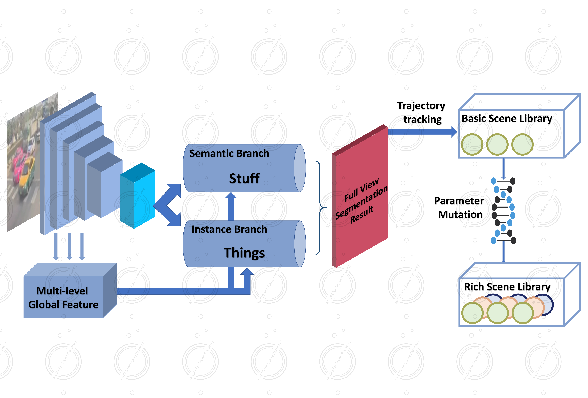

# M-CPS-for-Scene-Recovery
We propose the new panoptic segmentation model M-CPS. It uses dilated convolution to avoid the information loss, and uses global context and valid historical information to avoid pixel level allocation conflicts. And our model can effectively alleviate small object detection & segmentation and split object overlay. The pure panoptic segmentation results of our M-CPS model are on a par with the best benchmark model, and slightly improves in several evaluation indicators.
Then connected the results of scene recovery to mainstream test platforms in the industry, including simulation testing platforms such as Apollo and Carla. We then provide a mutation algorithm based on the original scene set to perform mutation testing. It supports mutation testing of changes in traffic participants' behavior or road conditions, greatly enriching the scene library for testing.
We use these recovered accident scenarios to test a series of open-source ADS models. And three types of scenarios are found that can lead to accidents of ADS prototypes, which indicates that the existing ADS prototype has defects and needs targeted improvement.
The flowchart of the overall algorithm framework is visible in 
